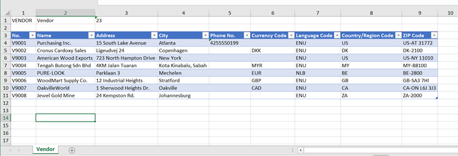

---
lab:
    title: 'Lab: Create and export a configuration package'
    module: 'Module 2: Application Setup'
---

## Exercise 1: Create and export a configuration package

### Scenario

After completing the basic configuration, you can now start by uploading the
company's business data, such as customers, vendors, items and the chart of
accounts.

In order to prepare the migration of this data, you will configure some
configuration packages and provide these excel-files to Contoso’s super users,
to complete the information.

You will start with the vendor list, including contact information. To make sure
the users know how to complete the required information, you prepare the
following example.

The following information is returned to you by Contoso’s super user:

### Tasks

1.  Create a configuration package.

2.  Assign tables and select fields.

3.  Export a configuration package to excel.

4.  Prepare data in excel.

### Steps

1.  Create a configuration package.

    1.  In the **Configuration Packages** page, click **New** to create a new
        configuration package.

    2.  In the **Code** field, enter VENDOR.

    3.  In the **Package Name** field, enter Vendor List.

2.  Assign tables and select fields.

    1.  On the **Tables** section of the Config. Package Card, enter a new line
        as follows.

    2.  Open the assist edit button to the right of the **Table ID** field.

    3.  In the window that opens, select the **Vendor** table and click **OK**.

    4.  Then press ENTER or TAB.

    5.  You will be asked to check related tables, click **No**.

    6.  Make sure the vendor table line is selected, select **Table** and then
        **Fields**.

    7.  On the field list page, first select **Clear Included**, to deselect the
        **Include Field** checkbox for all the fields.

    8.  Then select the **Include Field** checkbox for the following fields:

        1.  Name

        2.  Address

        3.  City

        4.  Phone No.

        5.  Currency Code

        6.  Language Code

        7.  Country/Region Code

        8.  Post Code

    9.  The **Validate Field** checkbox is automatically selected.

    10. Click **Close**.

3.  Export a configuration package to excel.

    1.  In the **Config. Package Card** page, select **Actions**, then
        **Package**, and then **Export to Excel**.

    2.  Click **Yes** to export the configuration package.

4.  Prepare data in excel.

    1.  Open the exported excel file from the download folder.

    2.  Enter the information as provided by Contoso.

    3.  Save the excel file.

## Exercise 2: Import and apply a configuration package

### Scenario

When the vendor information is completed, you can now upload the vendor
information.

During this process, you want to make sure the data is validated and when
missing, the related tables will be automatically updated with newly provided
values.

### Tasks

1.  Import a configuration package from excel.

2.  Apply a configuration package.

3.  Resolve package errors.

### Steps

1.  Import a configuration package from excel.

    1.  In the **Configuration Packages** page, select the new configuration
        package for vendors and select **Manage** and then **Edit**.

    2.  In the **Config. Package Card** page, select **Actions**, then select
        **Package**, and then **Import from Excel**.

    3.  Click **Choose…** and select the excel file.

    4.  Click **Open**.

    5.  In the preview page, select **Import**.

2.  Apply a configuration package.

    1.  In the **Config. Package Card** page, select **Actions**, then select
        **Functions**, and then **Apply Package**.

    2.  Click **Yes**.

3.  Resolve package errors.

    1.  In the **Config. Package Card** page, the vendor table line will show a
        number of errors.

    2.  Click on the number in the **No. of Package Errors** field.

    3.  In the error page, select the first record line and click **Show
        Error**.

    4.  Repeat for all the error records.

    5.  Click **OK**.

    6.  In the **Config. Package Card** page, select the vendor table line and
        select **Table** and then select **Fields**.

    7.  Select the **Create Missing Codes** check box, for the following fields:

        1.  Currency Code

        2.  Post Code

    8.  Click **Close**.

    9.  In the **Config. Package Card** page, select **Actions**, then select
        **Functions**, and then **Apply Package**.

    10. Click **Yes**.

    11. Click **OK**.

## Exercise 3: Import and apply a predefined package

### Scenario

For the further ease of the labs during the course, you will migrate the data
from the default CRONUS USA company within the database.

### Tasks

1.  Import and apply a predefined package.

### Steps

1.  Import and apply a predefined package.

    1.  In the **Configuration Packages** page, select **Actions**, then
        **Package**, and then select **Import Predefined Package**.

    2.  From the overview list, select the **Evaluation** package, containing
        the demo data.

    3.  Click **OK**.

    4.  Select the imported configuration package, select **Actions**, then
        **Functions**, and then select **Apply Package**.

    5.  Click **Yes**.

    6.  A warning appears, where you select the **I understand, and want to
        continue** checkbox and click **OK**.

    7.  Click **No** to any further questions.
